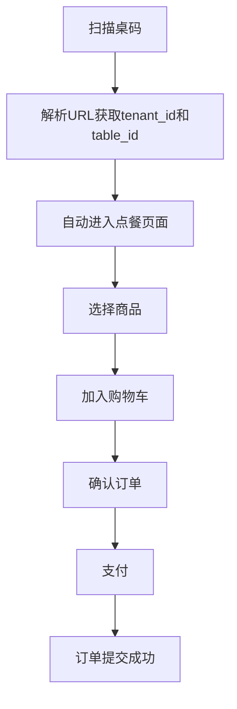
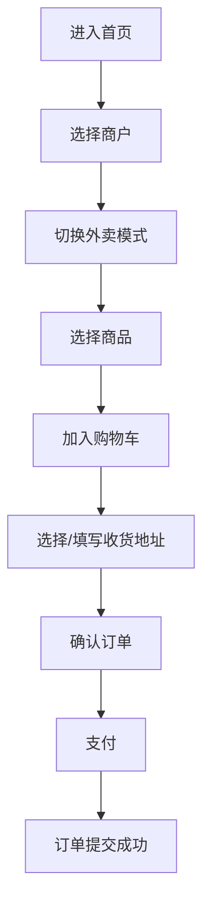
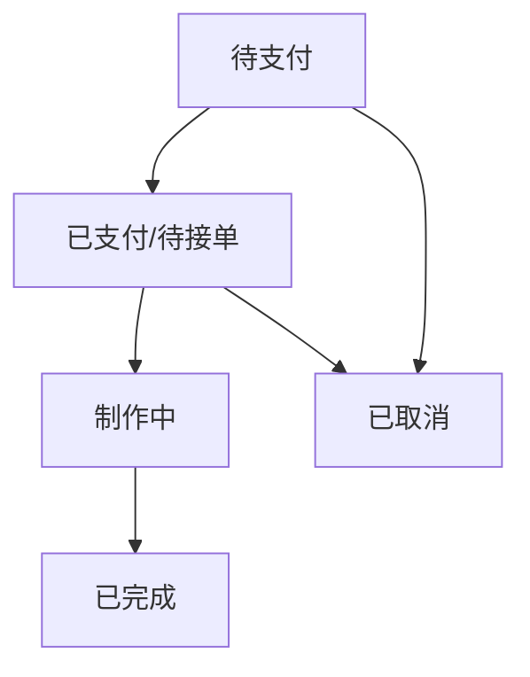

## 1. Product Overview
多租户餐饮点餐系统用户端，支持堂食扫码点餐和外卖点餐两种模式，采用前后端分离架构，可独立部署。

- **主要目的**: 为消费者提供便捷的移动端点餐体验，支持堂食和外卖场景
- **目标用户**: 餐厅顾客、外卖用户
- **市场价值**: 提升餐厅运营效率，降低人力成本，改善用户就餐体验

## 2. Core Features

### 2.1 User Roles
| Role | Registration Method | Core Permissions |
|------|---------------------|------------------|
| 普通用户 | 手机号快捷登录 | 浏览商品、下单、查看订单、管理收货地址 |

### 2.2 Feature Module
1. **首页**: 商户选择、模式切换（堂食/外卖）、商品分类展示
2. **点餐页面**: 商品网格展示、搜索、商品详情、规格选择
3. **购物车**: 商品列表、增减数量、清空、总价计算
4. **订单确认**: 桌号确认/地址选择、订单明细、支付
5. **订单列表**: 历史订单、状态跟踪
6. **个人中心**: 收货地址管理、订单查询、联系商家

### 2.3 Page Details
| Page Name | Module Name | Feature description |
|-----------|-------------|---------------------|
| 首页 | 商户选择 | 多租户展示，支持切换堂食/外卖模式 |
| 首页 | 商品分类 | 按分类展示商品网格，支持搜索 |
| 点餐页面 | 商品详情 | 规格选择、加料、数量调整 |
| 购物车 | 购物车管理 | 堂食/外卖独立购物车，支持增减、清空 |
| 订单确认 | 订单信息 | 桌号/地址确认、商品明细、总价 |
| 订单列表 | 订单管理 | 历史订单、状态跟踪、订单详情 |
| 个人中心 | 用户信息 | 收货地址管理、联系商家、订单入口 |

## 3. Core Process

### 3.1 堂食点餐流程

### 3.2 外卖点餐流程

### 3.3 订单状态流转

## 4. User Interface Design

### 4.1 Design Style
- **主色调**: 橙色 #FF6B35（活力、食欲）
- **辅助色**: 深灰色 #333333，浅灰色 #F5F5F5
- **按钮风格**: 圆角矩形，主色填充，白色文字
- **字体**: 思源黑体，清晰易读
- **布局风格**: 卡片式布局，商品大图展示
- **图标风格**: 简洁线性图标

### 4.2 Page Design Overview

| Page Name | Module Name | UI Elements |
|-----------|-------------|-------------|
| 首页 | 顶部导航 | Logo、搜索框、模式切换按钮 |
| 首页 | 商品分类 | 横向滚动分类标签 |
| 首页 | 商品列表 | 网格布局商品卡片（图片、名称、价格） |
| 点餐页面 | 商品详情 | 大图展示、规格选择器、数量加减、加入购物车按钮 |
| 购物车 | 商品列表 | 商品缩略图、名称、价格、数量、小计 |
| 购物车 | 结算区域 | 总价、去结算按钮 |
| 订单确认 | 信息区域 | 桌号/地址信息、配送费、总计 |
| 订单列表 | 订单卡片 | 订单号、时间、状态、金额 |
| 个人中心 | 功能入口 | 收货地址、我的订单、联系商家 |
| 底部导航 | Tab切换 | 点餐、购物车、我的 |

### 4.3 Responsiveness
- **移动端优先设计**
- 支持触摸操作优化
- 响应式布局适配不同屏幕尺寸

### 4.4 交互设计
- 商品卡片点击进入详情
- 购物车数量实时更新
- 订单状态实时同步
- 平滑页面切换动画
