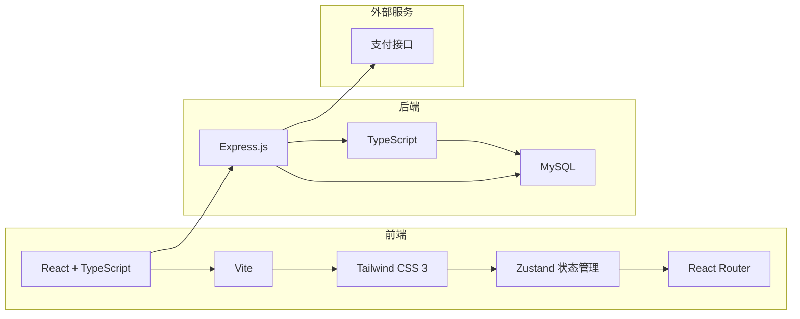
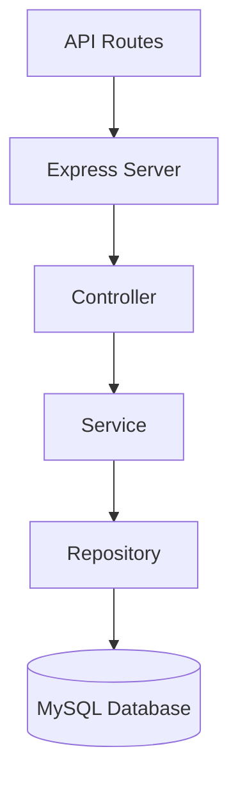
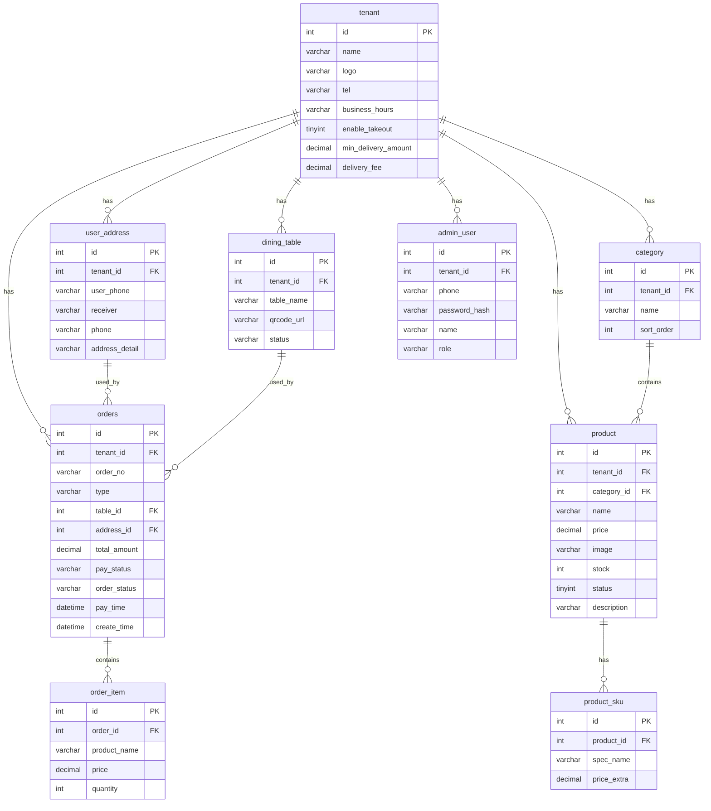

## 1. Architecture Design



## 2. Technology Description
- **Frontend**: React@18 + TypeScript + Tailwind CSS@3 + Vite
- **Backend**: Express.js@4 + TypeScript
- **Database**: MySQL 8.0+
- **State Management**: Zustand
- **Routing**: React Router DOM
- **HTTP Client**: Axios

## 3. Route Definitions

| Route | Purpose | Parameters |
|-------|---------|------------|
| / | 首页（选择商户/模式切换） | - |
| /menu/:tenantId | 点餐页面（堂食/外卖） | tenantId, tableId (query) |
| /menu/:tenantId/product/:productId | 商品详情 | tenantId, productId |
| /cart | 购物车页面 | - |
| /order/confirm | 订单确认页面 | - |
| /orders | 订单列表 | - |
| /orders/:orderId | 订单详情 | orderId |
| /profile | 个人中心 | - |
| /profile/addresses | 收货地址管理 | - |

## 4. API Definitions

### 4.1 租户相关
| API | Method | Description |
|-----|--------|-------------|
| /api/tenants | GET | 获取所有租户列表 |
| /api/tenants/:id | GET | 获取租户详情 |

### 4.2 商品相关
| API | Method | Description |
|-----|--------|-------------|
| /api/tenants/:tenantId/categories | GET | 获取商户商品分类 |
| /api/tenants/:tenantId/products | GET | 获取商户商品列表 |
| /api/tenants/:tenantId/products/:productId | GET | 获取商品详情 |

### 4.3 订单相关
| API | Method | Description |
|-----|--------|-------------|
| /api/orders | POST | 创建订单 |
| /api/orders | GET | 获取用户订单列表 |
| /api/orders/:orderId | GET | 获取订单详情 |
| /api/orders/:orderId/pay | POST | 支付订单 |
| /api/orders/:orderId/cancel | POST | 取消订单 |

### 4.4 地址相关
| API | Method | Description |
|-----|--------|-------------|
| /api/addresses | GET | 获取用户收货地址列表 |
| /api/addresses | POST | 创建收货地址 |
| /api/addresses/:id | PUT | 更新收货地址 |
| /api/addresses/:id | DELETE | 删除收货地址 |

### 4.5 桌号相关
| API | Method | Description |
|-----|--------|-------------|
| /api/tenants/:tenantId/tables | GET | 获取商户桌号列表 |
| /api/tables/:tableId | GET | 获取桌号详情 |

## 5. Server Architecture Diagram



## 6. Data Model

### 6.1 Data Model Definition



### 6.2 Data Definition Language

```sql
CREATE TABLE tenant (
    id INT PRIMARY KEY AUTO_INCREMENT,
    name VARCHAR(100) NOT NULL,
    logo VARCHAR(255),
    tel VARCHAR(20),
    business_hours VARCHAR(50),
    enable_takeout TINYINT DEFAULT 1,
    min_delivery_amount DECIMAL(10,2) DEFAULT 0,
    delivery_fee DECIMAL(10,2) DEFAULT 0,
    created_at TIMESTAMP DEFAULT CURRENT_TIMESTAMP,
    updated_at TIMESTAMP DEFAULT CURRENT_TIMESTAMP ON UPDATE CURRENT_TIMESTAMP
);

CREATE TABLE dining_table (
    id INT PRIMARY KEY AUTO_INCREMENT,
    tenant_id INT NOT NULL,
    table_name VARCHAR(50) NOT NULL,
    qrcode_url VARCHAR(255),
    status VARCHAR(20) DEFAULT 'available',
    created_at TIMESTAMP DEFAULT CURRENT_TIMESTAMP,
    updated_at TIMESTAMP DEFAULT CURRENT_TIMESTAMP ON UPDATE CURRENT_TIMESTAMP,
    FOREIGN KEY (tenant_id) REFERENCES tenant(id)
);

CREATE TABLE category (
    id INT PRIMARY KEY AUTO_INCREMENT,
    tenant_id INT NOT NULL,
    name VARCHAR(50) NOT NULL,
    sort_order INT DEFAULT 0,
    created_at TIMESTAMP DEFAULT CURRENT_TIMESTAMP,
    updated_at TIMESTAMP DEFAULT CURRENT_TIMESTAMP ON UPDATE CURRENT_TIMESTAMP,
    FOREIGN KEY (tenant_id) REFERENCES tenant(id)
);

CREATE TABLE product (
    id INT PRIMARY KEY AUTO_INCREMENT,
    tenant_id INT NOT NULL,
    category_id INT NOT NULL,
    name VARCHAR(100) NOT NULL,
    price DECIMAL(10,2) NOT NULL,
    image VARCHAR(255),
    stock INT DEFAULT 0,
    status TINYINT DEFAULT 1,
    description TEXT,
    created_at TIMESTAMP DEFAULT CURRENT_TIMESTAMP,
    updated_at TIMESTAMP DEFAULT CURRENT_TIMESTAMP ON UPDATE CURRENT_TIMESTAMP,
    FOREIGN KEY (tenant_id) REFERENCES tenant(id),
    FOREIGN KEY (category_id) REFERENCES category(id)
);

CREATE TABLE product_sku (
    id INT PRIMARY KEY AUTO_INCREMENT,
    product_id INT NOT NULL,
    spec_name VARCHAR(50) NOT NULL,
    price_extra DECIMAL(10,2) DEFAULT 0,
    created_at TIMESTAMP DEFAULT CURRENT_TIMESTAMP,
    FOREIGN KEY (product_id) REFERENCES product(id)
);

CREATE TABLE orders (
    id INT PRIMARY KEY AUTO_INCREMENT,
    tenant_id INT NOT NULL,
    order_no VARCHAR(50) UNIQUE NOT NULL,
    type VARCHAR(20) NOT NULL,
    table_id INT,
    address_id INT,
    total_amount DECIMAL(10,2) NOT NULL,
    pay_status VARCHAR(20) DEFAULT 'unpaid',
    order_status VARCHAR(20) DEFAULT 'pending',
    pay_time DATETIME,
    create_time TIMESTAMP DEFAULT CURRENT_TIMESTAMP,
    FOREIGN KEY (tenant_id) REFERENCES tenant(id),
    FOREIGN KEY (table_id) REFERENCES dining_table(id),
    FOREIGN KEY (address_id) REFERENCES user_address(id)
);

CREATE TABLE order_item (
    id INT PRIMARY KEY AUTO_INCREMENT,
    order_id INT NOT NULL,
    product_name VARCHAR(100) NOT NULL,
    price DECIMAL(10,2) NOT NULL,
    quantity INT NOT NULL,
    FOREIGN KEY (order_id) REFERENCES orders(id)
);

CREATE TABLE user_address (
    id INT PRIMARY KEY AUTO_INCREMENT,
    tenant_id INT NOT NULL,
    user_phone VARCHAR(20) NOT NULL,
    receiver VARCHAR(50) NOT NULL,
    phone VARCHAR(20) NOT NULL,
    address_detail TEXT NOT NULL,
    is_default TINYINT DEFAULT 0,
    created_at TIMESTAMP DEFAULT CURRENT_TIMESTAMP,
    updated_at TIMESTAMP DEFAULT CURRENT_TIMESTAMP ON UPDATE CURRENT_TIMESTAMP,
    FOREIGN KEY (tenant_id) REFERENCES tenant(id)
);

CREATE TABLE admin_user (
    id INT PRIMARY KEY AUTO_INCREMENT,
    tenant_id INT NOT NULL,
    phone VARCHAR(20) NOT NULL,
    password_hash VARCHAR(255) NOT NULL,
    name VARCHAR(50),
    role VARCHAR(20) DEFAULT 'admin',
    created_at TIMESTAMP DEFAULT CURRENT_TIMESTAMP,
    updated_at TIMESTAMP DEFAULT CURRENT_TIMESTAMP ON UPDATE CURRENT_TIMESTAMP,
    FOREIGN KEY (tenant_id) REFERENCES tenant(id)
);
```

### 6.3 初始数据

```sql
INSERT INTO tenant (name, logo, tel, business_hours, enable_takeout, min_delivery_amount, delivery_fee) VALUES
('美味餐厅', 'https://via.placeholder.com/100', '13800138000', '10:00-22:00', 1, 20, 5);

INSERT INTO dining_table (tenant_id, table_name, qrcode_url, status) VALUES
(1, '1号桌', 'http://localhost:8011/menu/1?tableId=1', 'available'),
(1, '2号桌', 'http://localhost:8011/menu/1?tableId=2', 'available'),
(1, '3号桌', 'http://localhost:8011/menu/1?tableId=3', 'available'),
(1, '4号桌', 'http://localhost:8011/menu/1?tableId=4', 'available'),
(1, '5号桌', 'http://localhost:8011/menu/1?tableId=5', 'available');

INSERT INTO category (tenant_id, name, sort_order) VALUES
(1, '热销推荐', 1),
(1, '主食', 2),
(1, '配菜', 3),
(1, '饮品', 4);

INSERT INTO product (tenant_id, category_id, name, price, image, stock, status, description) VALUES
(1, 1, '招牌红烧肉', 38.00, 'https://via.placeholder.com/300', 100, 1, '精选五花肉，肥而不腻'),
(1, 1, '清蒸鲈鱼', 48.00, 'https://via.placeholder.com/300', 50, 1, '新鲜鲈鱼，肉质鲜嫩'),
(1, 2, '蛋炒饭', 18.00, 'https://via.placeholder.com/300', 200, 1, '粒粒分明，蛋香浓郁'),
(1, 2, '红烧牛肉面', 28.00, 'https://via.placeholder.com/300', 100, 1, '大块牛肉，汤汁浓郁'),
(1, 3, '蒜蓉西兰花', 22.00, 'https://via.placeholder.com/300', 80, 1, '新鲜西兰花，蒜香扑鼻'),
(1, 3, '凉拌黄瓜', 12.00, 'https://via.placeholder.com/300', 100, 1, '清爽可口，开胃解腻'),
(1, 4, '可乐', 8.00, 'https://via.placeholder.com/300', 200, 1, '冰镇可乐，消暑解渴'),
(1, 4, '鲜榨橙汁', 15.00, 'https://via.placeholder.com/300', 50, 1, '新鲜橙子，现榨现卖');

INSERT INTO product_sku (product_id, spec_name, price_extra) VALUES
(1, '微辣', 0),
(1, '中辣', 2),
(1, '特辣', 4),
(4, '少面', 0),
(4, '正常', 0),
(4, '多加面', 5);
```
